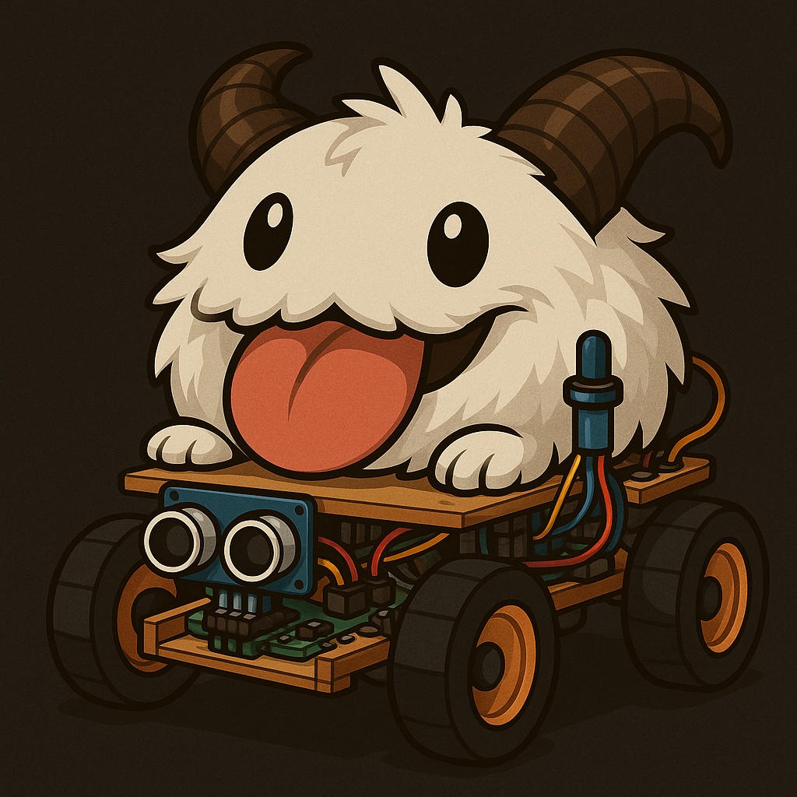

# Poro Car



## Table of Content

1. [Projektziel]()
2. [Hardware](#hardware) <br>
   2.1 [Microcontroller, Server, usw](#microcontroller-server-usw) <br>
   2.2 [Sensoren](#sensoren) <br>
3. [Softwarearchitektur](#softwarearchitektur) <br>
4. [Kommunikation](#kommunikation) <br>
5. [Backend](#backend) <br>
6. [Frontend](#frontend) <br>
7. [Issues](#issues) <br>
   7.1 [Planung](#planerstellung) <br>
   7.2 [Umsetung](#umsetzung) <br>
   7.3 [Messe Vorbereitung](#messevorbereitung) <br>
---

## Projektziel

Ziel ist die Realisierung eines cyberphysischen Systems zur smarten Automatisierung von Erkennung, Entscheidung und Steuerung über eine intelligente Fahrzeugplattform. Das Poro Car erfüllt folgende Anforderungen:

- Sensorische Erfassung durch Mikrocontroller
- Datenübertragung via WLAN, LAN und/oder 2,4GHz Funk
- Datenerfassung über MQTT-Broker
- Speicherung in einer relationalen Datenbank (PostgreSQL)
- Verteilung & Verarbeitung von Sensordaten zur Ermittlung von Sollwerten
- Kommunikation mit Aktoren über MQTT
- Visualisierung & Interaktion über eine Webanwendung

---

## Hardware

### Andere

- Auto chassis https://www.roboter-bausatz.de/p/bausatz-4wd-smart-car-chassis-fuer-roboter
- 

### Sensoren

wichtigkeit geht von 
``` 
-  1 = unnötig aber cool
 100 = absolut notwenig
```

| Sensor              | Funktion                         | Wichtigkeit | Verfügbarkeit     | Anmerkung                                                                                                                              |
|---------------------|----------------------------------|-------------|-------------------|----------------------------------------------------------------------------------------------------------------------------------------|
| Ultraschallsensor   | Abstandsmessung per Schall       |             | ✅ Vorhanden       | HC-SR04 im Koffer enthalten, https://www.roboter-bausatz.de/p/5x-hc-sr04-ultraschallsensor-entfernungsmesser?ra_id=4570449494&weiche=1 |
| Infrarotsensor      | IR-Kommunikation oder Erkennung  |             | ✅ Vorhanden       | HC-SR501 IR, KY-005 (IR Transmitter), KY-022 (IR Receiver), KY-032 (Hindernis-Detektor)                                                |
| Motordrehzahlsensor | Drehzahlmessung                  | 50          | ❌ Nicht vorhanden |                                                                                                                                        |
| Gyroskop            | Lagedetektion                    |             | ✅ Vorhanden       | MPU6050 Lage-Beschleunigungsensor                                                                                                      |
| Magnetometer        | Magnetfeldmessung (3D)           | 80          | ❌ Nicht direkt    | Nur einfache Magnetsensoren (KY-003, KY-024, KY-035)                                                                                   |
| Akkustandsensor     | Akkuspannung/-status             | 50          | ❌ Nicht vorhanden |                                                                                                                                        |
| Kamera              | Bilderfassung                    | 100         | ❌ Nicht vorhanden | https://www.reichelt.com/de/en/shop/product/raspberry_pi_-_camera_8mp_v2_imx219pq-170853 (9,80€)                                       |
| Geigerzähler        | Strahlungsmessung                | -1          | ❌ Nicht vorhanden |                                                                                                                                        |
| Schallsensor        | Schalldetektion                  |             | ✅ Vorhanden       | KY-037, KY-038 (Mikrofon-/Schallsensor)                                                                                                |
| Feinstaubsensor     | Luftqualität                     | -1          | ❌ Nicht vorhanden |                                                                                                                                        |
| Drucksensor         | Luftdruck / physikalischer Druck |             | ✅ Vorhanden       | BMP280 Luftdruck                                                                                                                       |
| Extra Drohne        | Zusatzgerät                      | -1          | ❌ Nicht vorhanden |                                                                                                                                        |
| Feuchtigkeitssensor | Luftfeuchtigkeit                 |             | ✅ Vorhanden       | KY-015 (Temp + Feuchte) + Luftfeuchtigkeits-Regensensor                                                                                |
| Temperatur          | Temperaturmessung                |             | ✅ Vorhanden       | KY-001, KY-013, KY-028, KY-015                                                                                                         |
| QR/Barcode scanner  | Codeerkennung                    | 80          | ❌ Nicht vorhanden |                                                                                                                                        |
| Lautstärke          | Schalldruckpegel                 |             | ✅ (indirekt)      | KY-037/038 können verwendet werden                                                                                                     |
| UV-Sensor           | UV-Lichtmessung                  | -1          | ❌ Nicht vorhanden |                                                                                                                                        |
| Mikrofon            | Geräuscherkennung                |             | ✅ Vorhanden       | KY-037, KY-038                                                                                                                         |
| ToF                 | Mapping                          | 100         | ❌ Nicht vorhanden | https://www.az-delivery.de/products/vl53l0x-time-of-flight-tof-laser-abstandssensor?variant=32344531435616 (18,99€)                    |
## Softwarearchitektur
                   
```
Arduino (Sensorik)(Auto) 
    |   ^
    |   |  Serielle Schnitstelle
    ^   |
Raspberry PI (auch auto) 
    |   ^
    |   | MQTT
    ^   |
Raspberry Pi Server <-> DB
    |   ^
    |   | WS, REST
    ^   |
Webclient
```

---

## Kommunikation

| Kommunikationsart          | Verwendungszweck                                          |
|:---------------------------|:----------------------------------------------------------|
| serielle Schnittstelle/LAN | Arduino und Berechnungsraspberry                          |
| WLAN                       | Webinterface, Kamera streaming                            |
| MQTT                       | Kommunikation zwischen berechnungsraspberry und Server/DB |

---

## Backend

- Server: Java 
- MQTT irgendwas
- DB: PostgreSQL
    -> alle möglichen sensordaten

---

## Frontend

- HTML, CSS, Angular
- Live kommunikation via Websockets
- Auto Daten:
  - Kamera
  - Füllstand akku
  - Luftqualität
  - ... alles wofür wir sensoren haben
    
- Route Tracking
- Manuelle Steuerung
...

---

## Issues

### Planerstellung

- Planen was alles benötigt wird
- Sachen suchen/bestellung aufsetzten
- klären ob das überhaupt cps ist (keine ahnung warum nicht)


### Umsetzung
...

### Messevorbereitung
...